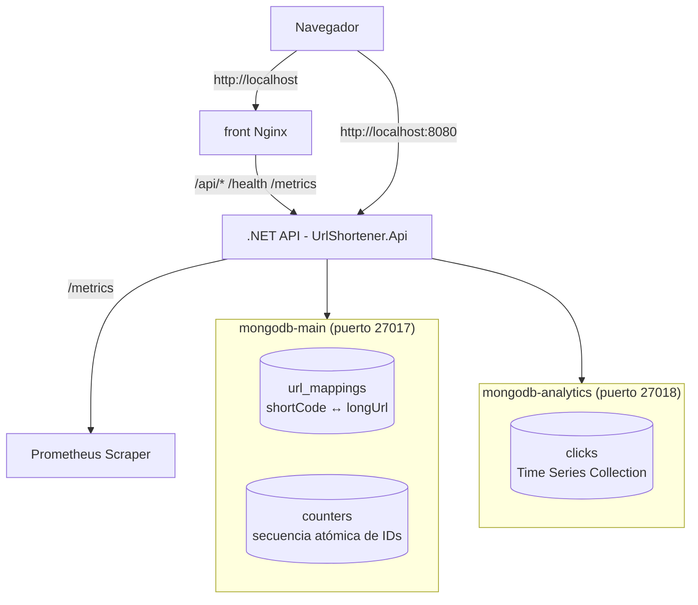
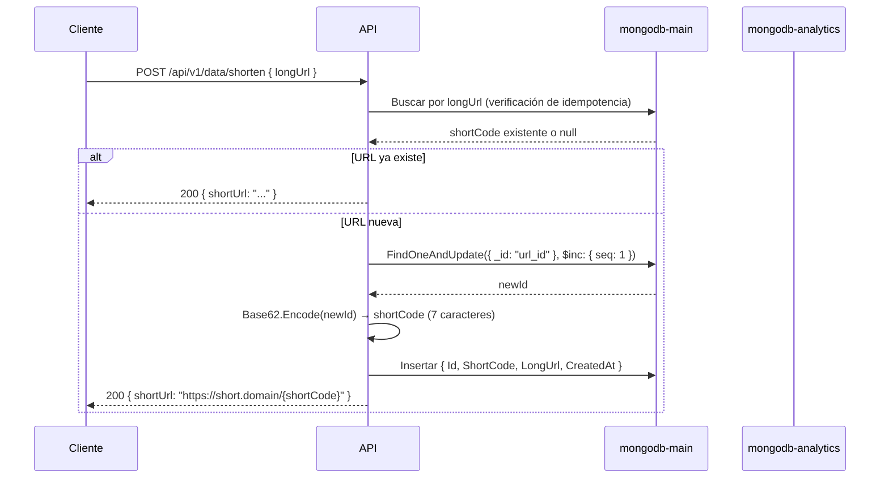
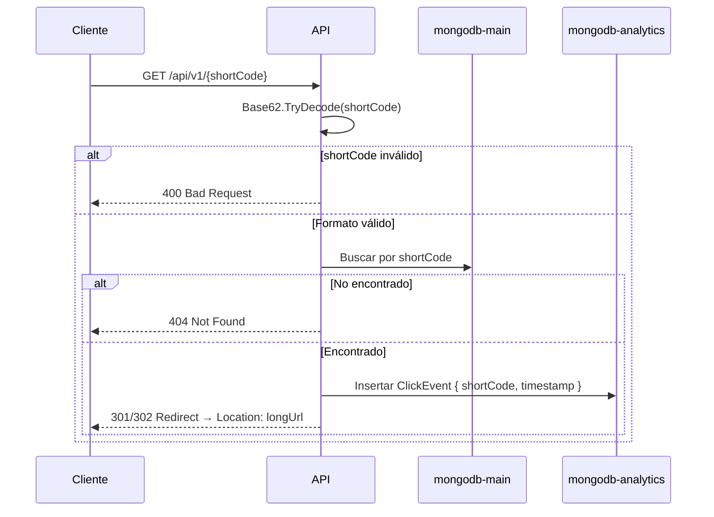

# URL Shortener — Documento de Diseño

## Planteamiento del Problema

Sistema extraído del libro **"System Design Interview — An Insider's Guide" (Volumen 1), Capítulo 8: Design A URL Shortener**.

Un acortador de URLs crea un alias corto (ej. `https://short.domain/zn9edcu`) a partir de una URL larga. Cuando un usuario hace clic en la URL corta, es redirigido a la URL original larga.

### Requisitos

| Requisito | Detalle |
|---|---|
| Acortamiento | `POST /api/v1/data/shorten` → devuelve URL corta |
| Redirección | `GET /api/v1/{shortCode}` → redirect 301/302 a la URL larga |
| Caracteres permitidos | `[0-9, a-z, A-Z]` (62 caracteres posibles) |
| Longitud de URL corta | 7 caracteres (62⁷ ≈ 3.5 billones, suficiente para 365B registros) |
| Volumen de escritura | 100 millones de URLs/día ≈ 1.160 escrituras/s |
| Volumen de lectura | Proporción 10:1 lectura/escritura ≈ 11.600 lecturas/s |
| Almacenamiento (10 años) | 365 mil millones de registros ≈ 365 TB |
| URLs inmutables | No se pueden eliminar ni actualizar |
| Tipo de redirect configurable | 301 (permanente) o 302 (temporal) vía variable de entorno |

---

## Visión General de la Arquitectura

### Diagrama del Sistema



### Flujo de Acortamiento



### Flujo de Redirección



---

## Decisiones de Diseño

| Decisión | Opción elegida | Alternativas | Justificación |
|---|---|---|---|
| **Función hash** | Conversión Base 62 | CRC32 / MD5 / SHA-1 + resolución de colisiones / Base64 | Se elige Base62 porque: (1) **Sin colisiones** — es biyectiva, cada ID numérico genera exactamente un shortCode. No necesita resolución de colisiones ni Bloom filters. (2) **URL-safe por construcción** — usa solo `[0-9a-zA-Z]`. A diferencia de Base64 (que tiene `/`, `+`, `=`), ningún caracter necesita percent-encoding. El `/` rompería el ruteo y `+` se interpreta como espacio en query strings. (3) **Longitud predecible** — con 7 caracteres (62⁷ ≈ 3.5 billones) se cubren los 365 mil millones de URLs estimados para 10 años. Es matemática pura: `Encode` y `TryDecode` en ~20 líneas, sin tablas de hash, sin loops de colisión, sin dependencias. |
| **Motor de almacenamiento** | MongoDB (WiredTiger) | BD relacional (PostgreSQL) + Redis cache | WiredTiger provee cache integrada (por defecto 50% de RAM - 1GB), eliminando la necesidad de una capa separada de Redis. Simplifica el stack manteniendo lecturas rápidas a esta escala (~11.6K req/s). |
| **Dos instancias mongod vs. una con dos colecciones** | Dos procesos `mongod` independientes | Un solo `mongod` con bases de datos separadas | **Decisión arquitectónica clave.** WiredTiger asigna su cache por proceso `mongod`, no por base de datos. Si `clicks` (alto volumen de escritura) y `url_mappings` (alto volumen de lectura) compartieran la misma cache, los inserts desplazarían páginas de URL mappings, degradando la latencia de redirects. Dos instancias separadas garantizan aislamiento total de cache, cada una con su propio pool WiredTiger + filesystem cache del SO. Se ejecutan en la misma red Docker (latencia submilisegundo) y requieren recursos extra mínimos. Es el diseño correcto para producción — el costo de un contenedor extra es despreciable vs. el costo de contención de cache a escala. |
| **Generación de IDs** | Contador atómico MongoDB (`$inc`) | Snowflake / UUID / ObjectId | Para una configuración de un solo mongod, un contador atómico en una colección `counters` dedicada es la solución correcta más simple. Es un solo `FindOneAndUpdate` + `$inc` — sin dependencias externas, sin sincronización de reloj. Snowflake sería necesario solo en un entorno clusterizado/shardeado. Complejidad hacia abajo: quien llama no sabe ni le importa cómo se generan los IDs. |
| **Analytics de clicks** | Time Series Collection (mongod separado) | Campo `clickCount` en el mapping de URL | Un contador simple por URL es insuficiente para análisis de series temporales. Almacenar eventos individuales `{ shortCode, timestamp }` en una Time Series Collection de MongoDB permite consultas como clicks por hora/día, URLs con tendencia, etc. Las Time Series Collections usan compresión zstd (~70% de ahorro de espacio) y bucketing automático. El mongod separado evita que las escrituras de analytics contaminen la cache principal. |
| **Tipo de redirect** | Configurable (301/302) vía env var | Hardcoded | El libro discute ambos: 301 (permanente, cacheado por el navegador, menos carga en el servidor) vs. 302 (temporal, más amigable para analytics). Hacerlo configurable permite al operador elegir por despliegue sin cambios de código. |
| **Estilo de API** | Controllers (MVC) | Minimal API | Los Controllers proveen un enfoque más estructurado para equipos, con separación clara de definiciones de ruta, enlace de modelos y atributos de validación. Patrón familiar en el ecosistema .NET. |
| **Manejo de errores** | Estrategia de 3 capas (validación → nullable → middleware) | `Result<T>` / `OneOf` | `null` es suficiente para "no encontrado" en este dominio. El prefijo `Try*` para validación de formato evita excepciones. Un middleware global de exception handler atrapa errores inesperados y devuelve ProblemDetails. `Result<T>` agrega ceremonia sin valor para un servicio con 2 métodos. *Define errors out of existence:* validar en el borde para que los datos inválidos nunca lleguen al núcleo. |
| **Métricas** | `System.Diagnostics.Metrics` + OpenTelemetry Prometheus exporter | Application Insights / DataDog | Sin vendor lock-in, API estándar de .NET, expone `/metrics` en formato Prometheus. Funciona con cualquier stack de observabilidad. El exporter de Prometheus es liviano — no necesita agente separado. |
| **Docker** | Build multi-stage + docker-compose | Contenedor único / deploy manual | Entorno reproducible. Docker Compose orquesta los cuatro servicios (API + 2x MongoDB + frontend Nginx). Healthchecks aseguran el orden de inicio correcto. El frontend usa Nginx para servir estáticos y hacer proxy reverso a la API, eliminando problemas de CORS en producción. |
| **CORS** | `AddCors()` con origen `http://localhost` | Proxy reverso en Nginx (sin CORS) | Se configuró CORS en la API para permitir desarrollo local donde el front (puerto 80) y la API (8080) son orígenes distintos. En producción, el proxy reverso de Nginx evita la necesidad de CORS, pero tenerlo configurado no afecta. Es la opción más realista: el equipo de front puede desarrollar contra la API directamente sin depender del proxy.

---

## Estrategia de Métricas

### Capa 1 — Métricas Operacionales (en memoria, vía OpenTelemetry)

Expuestas en `GET /metrics` en formato Prometheus. Para alertas de tasa, SLOs de latencia y planificación de capacidad.

| Métrica | Tipo | Qué mide |
|---|---|---|
| `urlshortener_shorten_duration_milliseconds` | Histograma | Latencia de solicitudes de acortamiento |
| `urlshortener_redirect_duration_milliseconds` | Histograma | Latencia de búsquedas de redirect |
| `urlshortener_shorten_total` | Contador | Total de URLs acortadas |
| `urlshortener_redirect_total` | Contador | Total de redirects servidos |

Las métricas integradas de ASP.NET Core (tasa de solicitudes, duración, etc.) también están disponibles automáticamente vía `AddAspNetCoreInstrumentation()`.

### Capa 2 — Datos de Analytics (persistidos, en MongoDB)

Cada redirect inserta un documento `ClickEvent` en la Time Series Collection:

```json
{
  "shortCode": "zn9edcu",
  "timestamp": "2026-06-12T14:30:00Z"
}
```

Esto permite consultas de series temporales: clicks por hora/día, URLs principales, análisis de tendencias. No hay un endpoint de analytics en esta versión — los datos están listos para consumo futuro.

**Nota de cardinalidad:** las métricas NO usan labels por URL individual. En Prometheus, cada combinación única de labels crea una serie de tiempo nueva. Con millones de URLs distintas, la cardinalidad de labels explotaría (Prometheus tiene límites duros de ~500K series por servidor y se degrada muy mal más allá). Por eso el conteo por URL se almacena en MongoDB, no en Prometheus. Para datos agregados (total de redirects, latencia), Prometheus es la herramienta correcta. Para datos por URL individual, MongoDB.

---

## Modelo de Datos

### `urlshortener.url_mappings`

```json
{
  "_id": 2009215674938,
  "shortCode": "zn9edcu",
  "longUrl": "https://en.wikipedia.org/wiki/Systems_design",
  "createdAt": "2026-06-12T10:00:00Z"
}
```

Índices:
- `{ shortCode: 1 }` (único) — búsqueda rápida de redirect
- `{ longUrl: 1 }` (único) — verificación rápida de idempotencia

### `urlshortener.counters`

```json
{ "_id": "url_id", "seq": 2009215674938 }
```

### `urlshortener_analytics.clicks` (Time Series Collection)

Configuración Time Series:
- `timeField`: `"timestamp"`
- `metaField`: `"shortCode"`
- `granularity`: `"seconds"`

---

## Estrategia de Manejo de Errores

Tres capas, sin sobreingeniería:

| Capa | Mecanismo | Escenario de ejemplo |
|---|---|---|
| **1. Validación en borde** (Controller) | Data annotations (`[Required]`, `[Url]`), `ModelState.IsValid`, `Base62Converter.TryDecode` | URL malformada → 400 antes de tocar el servicio |
| **2. Tipos seguros** (Service) | `TryDecode` en vez de lanzar excepción, retornos nullable en vez de excepciones | shortCode inválido → `false`, no un `FormatException` |
| **3. Middleware global** (Pipeline) | `UseExceptionHandler` + `ProblemDetails` | MongoDB inalcanzable → 500 con detalle estructurado (verbose en development) |

Sin `Result<T>`, sin `OneOf`, sin tipos de excepción personalizados. *Define errors out of existence:* el controller atrapa errores de formato antes de que se propaguen; el servicio usa tipos que hacen imposibles los estados inválidos; el middleware es la red de seguridad para fallos realmente inesperados.

---

## Referencia de API

### POST /api/v1/data/shorten

Crea una URL corta para la URL larga dada. Idempotente — llamar con la misma `longUrl` devuelve la misma `shortUrl`.

**Solicitud:**
```json
{ "longUrl": "https://en.wikipedia.org/wiki/Systems_design" }
```

**Éxito (200):**
```json
{ "shortUrl": "http://localhost:8080/zn9edcu" }
```

**Error de validación (400):**
```json
{
  "type": "https://tools.ietf.org/html/rfc9110#section-15.5.1",
  "title": "One or more validation errors occurred.",
  "status": 400,
  "errors": { "longUrl": ["The longUrl field is not a valid fully-qualified URL."] }
}
```

### GET /api/v1/{shortCode}

Redirige a la URL larga original.

| Estado | Cuándo | Respuesta |
|---|---|---|
| **301 o 302** | shortCode existe | `Location: <longUrl>` (sin cuerpo) |
| **400** | Formato de shortCode inválido | ProblemDetails |
| **404** | Formato válido pero no encontrado | ProblemDetails |

### GET /health

**200 OK** — Usado por el healthcheck de Docker y sondas del balanceador de carga.

### GET /api/v1/urls

Lista todas las URLs acortadas, ordenadas de más reciente a más antigua.

**Éxito (200):**
```json
[
  { "shortCode": "zn9edcu", "longUrl": "https://...", "createdAt": "2026-06-12T10:00:00Z" },
  ...
]
```

### GET /api/v1/{shortCode}/clicks

Devuelve el conteo de clicks de una URL agrupado por unidad de tiempo. Ideal para gráficos.

**Parámetros query:**

| Parámetro | Tipo | Default | Descripción |
|---|---|---|---|
| `from` | `DateTime` | `now - 30d` | Inicio del rango |
| `to` | `DateTime` | `now` | Fin del rango |
| `bucket` | `string` | `"hour"` | Unidad de agrupación: `minute`, `hour` o `day` |

**Éxito (200):**
```json
{
  "shortCode": "zn9edcu",
  "from": "2026-06-01T00:00:00Z",
  "to": "2026-06-12T00:00:00Z",
  "bucket": "day",
  "data": [
    { "timestamp": "2026-06-01T00:00:00Z", "count": 15 },
    { "timestamp": "2026-06-02T00:00:00Z", "count": 42 }
  ]
}
```

**Error (400):** shortCode inválido o `bucket` no es `minute`, `hour` o `day`.

### GET /api/v1/analytics/top

Devuelve las URLs más clickeadas en un rango de tiempo.

**Parámetros query:**

| Parámetro | Tipo | Default | Descripción |
|---|---|---|---|
| `limit` | `int` | `10` | Cantidad de resultados (máx. 100) |
| `from` | `DateTime` | `now - 7d` | Inicio del rango |
| `to` | `DateTime` | `now` | Fin del rango |

**Éxito (200):**
```json
{
  "from": "2026-06-05T00:00:00Z",
  "to": "2026-06-12T00:00:00Z",
  "limit": 5,
  "data": [
    { "shortCode": "zn9edcu", "longUrl": "https://...", "clickCount": 150 },
    ...
  ]
}
```

---

## Compromisos y Simplificaciones

| Excluido | Por qué | Qué haría falta para agregarlo |
|---|---|---|
| **Rate limiter** | No seleccionado por el usuario. Preveniría abusos | Integrar `AspNetCoreRateLimit` o un middleware token-bucket |
| **Redis cache** | WiredTiger proporciona cache suficiente a esta escala | Agregar `IDistributedCache` con Redis para búsquedas de URLs populares |
| **Autenticación** | Fuera del alcance del desafío | Agregar JWT bearer + middleware de API key |
| **Sharding de BD** | Configuración de un solo nodo; sharding agrega complejidad | Agregar shard key de MongoDB en `shortCode` para `url_mappings`, basado en tiempo para `clicks` |
| **Frontend/UI** | Solo API | Agregar un SPA simple (React/Vue) o un formulario Razor Pages |
| **CI/CD** | Despliegue manual | Agregar GitHub Actions + push a Docker registry |
| **Prometheus/Grafana** | Solo el endpoint `/metrics` está expuesto | Agregar servicios `prometheus` + `grafana` al `docker-compose.yml` |
| **Swagger en producción** | Solo Development | Cambiar el guardia `if (env.IsDevelopment())` |

---

## Desarrollo Local

```bash
# Compilar
dotnet build

# Ejecutar tests
dotnet test

# Iniciar todos los servicios
docker-compose up -d

# Probar acortamiento
curl -X POST http://localhost:8080/api/v1/data/shorten \
  -H 'Content-Type: application/json' \
  -d '{"longUrl":"https://example.com/a-very-long-url"}'

# Probar redirect
curl -v http://localhost:8080/zn9edcu

# Ver métricas
curl http://localhost:8080/metrics

# Ver eventos de click en la BD de analytics
mongosh mongodb://localhost:27018/urlshortener_analytics \
  --eval 'db.clicks.countDocuments({shortCode:"zn9edcu"})'
```

---

## Referencias

1. Alex Xu — *System Design Interview — An Insider's Guide* (Volumen 1), Capítulo 8: Design A URL Shortener
2. John Ousterhout — *A Philosophy of Software Design* (2ª Edición)
3. MongoDB — [Time Series Collections](https://www.mongodb.com/docs/manual/core/timeseries-collections/)
4. MongoDB — [WiredTiger Storage Engine](https://www.mongodb.com/docs/manual/core/wiredtiger/)
5. OpenTelemetry .NET — [Metrics API](https://opentelemetry.io/docs/languages/net/instrumentation/)
