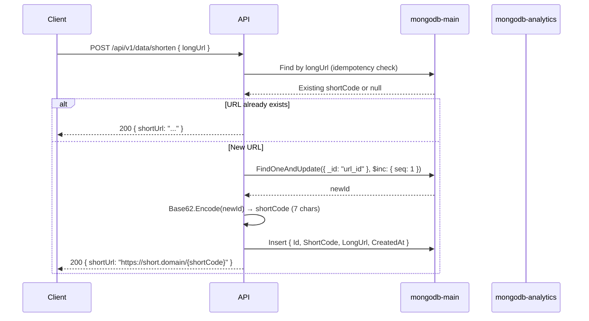
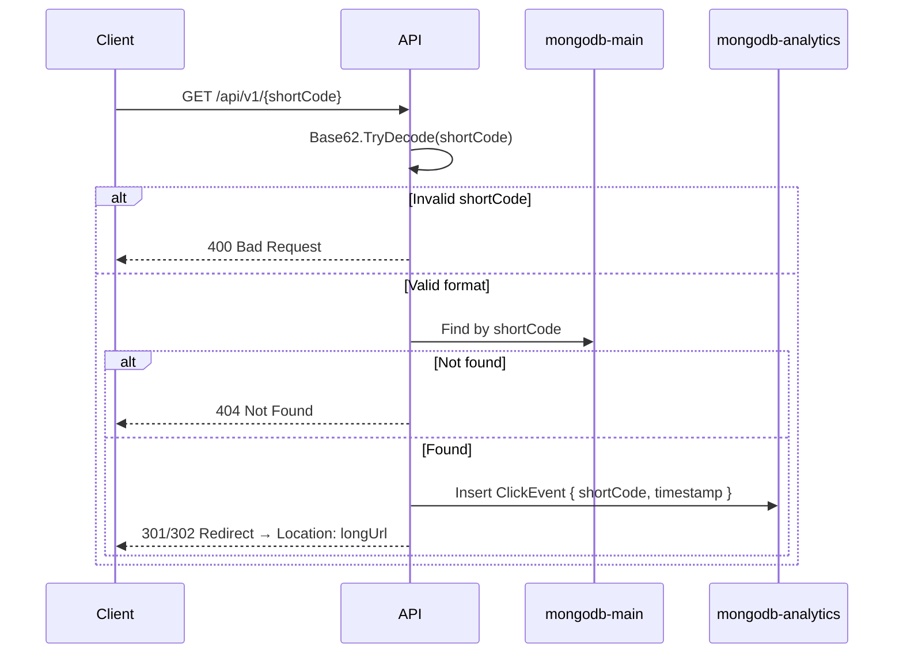

# URL Shortener — Design Document

## Problem Statement

System taken from **"System Design Interview — An Insider's Guide" (Volume 1), Chapter 8: Design A URL Shortener**.

A URL shortener creates a short alias (e.g. `https://short.domain/zn9edcu`) for a given long URL. When a user clicks the short URL, they are redirected to the original long URL.

### Requirements

| Requirement | Detail |
|---|---|
| URL shortening | `POST /api/v1/data/shorten` → returns short URL |
| URL redirecting | `GET /api/v1/{shortCode}` → 301/302 redirect to long URL |
| Short URL characters | `[0-9, a-z, A-Z]` (62 possible characters) |
| Short URL length | 7 characters (62⁷ ≈ 3.5 trillion, enough for 365B records) |
| Write volume | 100 million URLs/day ≈ 1,160 writes/s |
| Read volume | 10:1 read/write ratio ≈ 11,600 reads/s |
| Storage (10 years) | 365 billion records ≈ 365 TB |
| Short URLs are immutable | Cannot be deleted or updated |
| Redirect type configurable | 301 (permanent) or 302 (temporary) via environment variable |

---

## Architecture Overview

### System Diagram

```mermaid
graph TD
    Client[Client Browser/App] -->|POST /shorten| LB[Load Balancer]
    Client -->|GET /{shortCode}| LB
    LB --> API[.NET API - UrlShortener.Api]

    API --> MainDB[(mongodb-main<br/>WiredTiger Cache #1)]
    API --> AnalyticsDB[(mongodb-analytics<br/>WiredTiger Cache #2)]

    subgraph MainDB["mongodb-main (port 27017)"]
        UrlMappings[(url_mappings<br/>shortCode ↔ longUrl)]
        Counters[(counters<br/>atomic ID sequence)]
    end

    subgraph AnalyticsDB["mongodb-analytics (port 27018)"]
        Clicks[(clicks<br/>Time Series Collection)]
    end

    API -->|/metrics| Prometheus[Prometheus Scraper]
```

### URL Shortening Flow



### URL Redirecting Flow



---

## Design Decisions

| Decision | Chosen approach | Alternatives | Rationale |
|---|---|---|---|
| **Hash function** | Base 62 conversion | CRC32 / MD5 / SHA-1 + collision resolution | No collisions (bijective). Simple math. Each long URL maps to a unique short code deterministically via its numeric ID. Deep module: the converter has a tiny API surface but encapsulates non-trivial math. |
| **Storage engine** | MongoDB (WiredTiger) | Relational DB (PostgreSQL) + Redis cache | WiredTiger provides built-in caching (default 50% RAM - 1GB), eliminating the need for a separate Redis/cache layer. Simplifies the stack while keeping reads fast at this scale (~11.6K req/s). |
| **Two mongod instances vs one with two collections** | Two independent `mongod` processes | Single `mongod` with separate databases | **Key architectural decision.** WiredTiger allocates its cache per `mongod` process, not per database. If `clicks` (high write volume) and `url_mappings` (high read volume) shared the same cache, inserts would evict URL mapping pages, degrading redirect latency. Two separate instances guarantee complete cache isolation, each with its own WiredTiger pool + OS filesystem cache. They run in the same Docker network (latency sub-millisecond) and require minimal extra resources. This is the correct design for production — the cost of one extra container is negligible vs. the cost of cache contention at scale. |
| **ID generation** | MongoDB atomic counter (`$inc`) | Snowflake / UUID / ObjectId | For a single-mongod setup, an atomic counter on a dedicated `counters` collection is the simplest correct solution. It's a single `FindOneAndUpdate` + `$inc` — no external dependencies, no clock synchronization. Snowflake would be needed only in a sharded/clustered environment. Pull complexity downward: the caller doesn't know or care how IDs are generated. |
| **Click analytics** | Time Series Collection (separate `mongod`) | `clickCount` field on URL mapping | A simple counter per URL is insufficient for time-series analysis. Storing individual `{ shortCode, timestamp }` events in a MongoDB Time Series Collection enables queries like clicks per hour/day, trending URLs, etc. Time Series Collections use zstd compression (~70% space savings) and automatic bucketing. The separate `mongod` prevents analytics writes from polluting the main cache. |
| **Redirect type** | Configurable (301/302) via env var | Hardcoded | The book discusses both: 301 (permanent, cached by browser, less server load) vs 302 (temporary, more analytics-friendly). Making it configurable allows the operator to choose per-deployment without code changes. |
| **API style** | Controllers (MVC) | Minimal API | Controllers provide a more structured approach for teams, with clear separation of route definitions, model binding, and validation attributes. Familiar pattern in the .NET ecosystem. |
| **Error handling** | 3-layer strategy (validation → nullable → middleware) | `Result<T>` / `OneOf` | `null` is sufficient for "not found" in this domain. `Try*` prefix for format validation avoids exceptions. A global exception handler middleware catches unexpected errors and returns ProblemDetails. `Result<T>` adds ceremony without value for a service with 2 methods. *Define errors out of existence:* validate at the edge so invalid data never reaches the core. |
| **Metrics** | `System.Diagnostics.Metrics` + OpenTelemetry Prometheus exporter | Application Insights / DataDog | Zero vendor lock-in, standard .NET API, exposes `/metrics` in Prometheus format. Works with any observability stack. The Prometheus exporter is lightweight — no separate agent needed. |
| **Docker** | Multi-stage build + docker-compose | Single container / manual deploy | Reproducible environment. Docker Compose orchaestrates all three services (API + 2x MongoDB). Healthchecks ensure proper startup ordering. |

---

## Metrics Strategy

### Layer 1 — Operational Metrics (in-memory, via OpenTelemetry)

Exposed at `GET /metrics` in Prometheus format. For rate alerts, latency SLOs, and capacity planning.

| Metric | Type | What it measures |
|---|---|---|
| `urlshortener_shorten_duration_milliseconds` | Histogram | Latency of shortening requests |
| `urlshortener_redirect_duration_milliseconds` | Histogram | Latency of redirect lookups |
| `urlshortener_shorten_total` | Counter | Total URLs shortened |
| `urlshortener_redirect_total` | Counter | Total redirects served |

ASP.NET Core's built-in metrics (request rate, duration, etc.) are also automatically available via `AddAspNetCoreInstrumentation()`.

### Layer 2 — Analytics Data (persisted, in MongoDB)

Each redirect inserts a `ClickEvent` document into the Time Series Collection:

```json
{
  "shortCode": "zn9edcu",
  "timestamp": "2026-06-12T14:30:00Z"
}
```

This enables time-series queries: clicks per hour/day, top URLs, trend analysis. There is no analytics API endpoint in this version — the data is ready for future consumption.

**Cardinality note:** metrics do NOT use per-URL tags. Per-URL cardinality would explode Prometheus label cardinality limits. For per-URL data, use the MongoDB `clicks` collection.

---

## Data Model

### `urlshortener.url_mappings`

```json
{
  "_id": 2009215674938,
  "shortCode": "zn9edcu",
  "longUrl": "https://en.wikipedia.org/wiki/Systems_design",
  "createdAt": "2026-06-12T10:00:00Z"
}
```

Indexes:
- `{ shortCode: 1 }` (unique) — fast redirect lookup
- `{ longUrl: 1 }` (unique) — fast idempotency check

### `urlshortener.counters`

```json
{ "_id": "url_id", "seq": 2009215674938 }
```

### `urlshortener_analytics.clicks` (Time Series Collection)

Time Series configuration:
- `timeField`: `"timestamp"`
- `metaField`: `"shortCode"`
- `granularity`: `"seconds"`

---

## Error Handling Strategy

Three layers, no overengineering:

| Layer | Mechanism | Example scenario |
|---|---|---|
| **1. Edge validation** (Controller) | Data annotations (`[Required]`, `[Url]`), `ModelState.IsValid`, `Base62Converter.TryDecode` | Malformed URL → 400 before touching the service |
| **2. Safe types** (Service) | `TryDecode` instead of throwing, nullable returns instead of exceptions | Invalid shortCode → `false`, not a `FormatException` |
| **3. Global middleware** (Pipeline) | `UseExceptionHandler` + `ProblemDetails` | MongoDB unreachable → 500 with structured error detail (verbose in development) |

No `Result<T>`, no `OneOf`, no custom exception types. *Define errors out of existence:* the controller catches format errors before they propagate; the service uses types that make invalid states unrepresentable; the middleware is the safety net for truly unexpected failures.

---

## API Reference

### POST /api/v1/data/shorten

Creates a short URL for the given long URL. Idempotent — calling with the same `longUrl` returns the same `shortUrl`.

**Request:**
```json
{ "longUrl": "https://en.wikipedia.org/wiki/Systems_design" }
```

**Success (200):**
```json
{ "shortUrl": "http://localhost:8080/zn9edcu" }
```

**Validation error (400):**
```json
{
  "type": "https://tools.ietf.org/html/rfc9110#section-15.5.1",
  "title": "One or more validation errors occurred.",
  "status": 400,
  "errors": { "longUrl": ["The longUrl field is not a valid fully-qualified URL."] }
}
```

### GET /api/v1/{shortCode}

Redirects to the original long URL.

| Status | When | Response |
|---|---|---|
| **301 or 302** | Short code exists | `Location: <longUrl>` (no body) |
| **400** | Invalid short code format | ProblemDetails |
| **404** | Valid format but not found | ProblemDetails |

### GET /health

**200 OK** — Used by Docker healthcheck and load balancer probes.

---

## Trade-offs & Simplifications

| Excluded | Why | What it would take to add |
|---|---|---|
| **Rate limiter** | Not selected by the user. Would prevent abuse | Integrate `AspNetCoreRateLimit` or a token-bucket middleware |
| **Analytics API** | No endpoint to query `clicks` data yet | Add `GET /api/v1/{shortCode}/analytics` endpoint |
| **Redis cache** | WiredTiger provides sufficient caching at this scale | Add `IDistributedCache` with Redis for hot URL lookups |
| **Authentication** | Out of scope for the challenge | Add JWT bearer + API key middleware |
| **Database sharding** | Single-node setup; sharding adds complexity | Add MongoDB shard key on `shortCode` for `url_mappings`, time-based for `clicks` |
| **Frontend/UI** | API-only | Add a simple SPA (React/Vue) or Razor Pages form |
| **CI/CD** | Manual deployment | Add GitHub Actions + Docker registry push |
| **Prometheus/Grafana** | Only the `/metrics` endpoint is exposed | Add `prometheus` + `grafana` services to `docker-compose.yml` |
| **Swagger in production** | Development only | Change `if (env.IsDevelopment())` guard |

---

## Local Development

```bash
# Build
dotnet build

# Run tests
dotnet test

# Start all services
docker-compose up -d

# Test shortening
curl -X POST http://localhost:8080/api/v1/data/shorten \
  -H 'Content-Type: application/json' \
  -d '{"longUrl":"https://example.com/a-very-long-url"}'

# Test redirect
curl -v http://localhost:8080/zn9edcu

# Check metrics
curl http://localhost:8080/metrics

# Check click events in analytics DB
mongosh mongodb://localhost:27018/urlshortener_analytics \
  --eval 'db.clicks.countDocuments({shortCode:"zn9edcu"})'
```

---

## References

1. Alex Xu — *System Design Interview — An Insider's Guide* (Volume 1), Chapter 8: Design A URL Shortener
2. John Ousterhout — *A Philosophy of Software Design* (2nd Edition)
3. MongoDB — [Time Series Collections](https://www.mongodb.com/docs/manual/core/timeseries-collections/)
4. MongoDB — [WiredTiger Storage Engine](https://www.mongodb.com/docs/manual/core/wiredtiger/)
5. OpenTelemetry .NET — [Metrics API](https://opentelemetry.io/docs/languages/net/instrumentation/)
